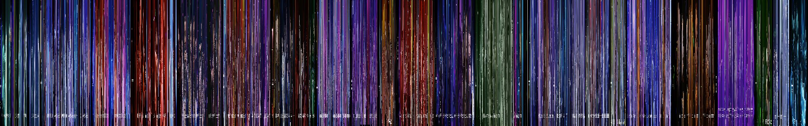

# Filmspec

Herramienta CLI para generar imágenes de espectro de películas a partir de archivos de video.

#### Cómo Funciona

Filmspec muestrea uniformemente fotogramas de un archivo de video a lo largo del tiempo, extrae una línea de píxeles (fila o columna) de cada fotograma y los apila para crear un espectro visual único.



#### Modos de Muestreo y Diseño

| Modo de Corte | Descripción |
|---------------|-------------|
| row | Extrae la línea horizontal central de cada fotograma |
| col | Extrae la línea vertical central de cada fotograma |

| Modo de Diseño | Descripción |
|----------------|-------------|
| h | Apilar horizontalmente (izquierda a derecha) |
| v | Apilar verticalmente (arriba a abajo) |

#### Requisitos Previos

- Rust 1.70+
- FFmpeg (debe estar disponible en el PATH del sistema)

#### Instalación

```bash
cargo install --path .
```

#### Uso

```bash
filmspec <INPUT> [OPTIONS]
```

#### Opciones

| Opción | Corto | Descripción | Predeterminado |
|--------|-------|-------------|----------------|
| `<INPUT>` | - | Ruta del archivo de video | requerido |
| `--output` | `-o` | Ruta de la imagen de salida | `<nombre>_spectrum.png` |
| `--width` | `-w` | Ancho de la imagen | 1920 |
| `--height` | `-H` | Alto de la imagen | 300 |
| `--layout` | `-l` | Dirección del diseño h/v | h |
| `--slice` | `-s` | Dirección del corte row/col | row |

#### Ejemplos

```bash
# Predeterminado (1920×300, diseño horizontal, corte por fila)
filmspec movie.mp4

# Ruta y tamaño personalizados
filmspec movie.mp4 -o output.png -w 1280 -H 400

# Diseño vertical (apilar de arriba a abajo)
filmspec movie.mp4 -l v

# Corte por columna (extraer líneas de píxeles verticales)
filmspec movie.mp4 -s col
```

#### Licencia

MIT

