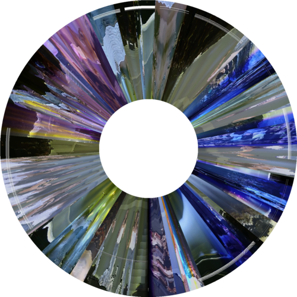
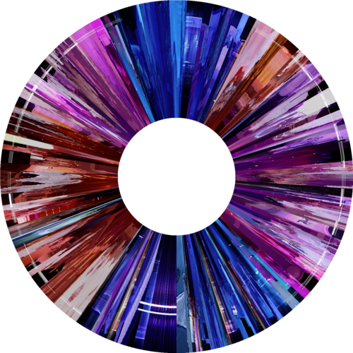
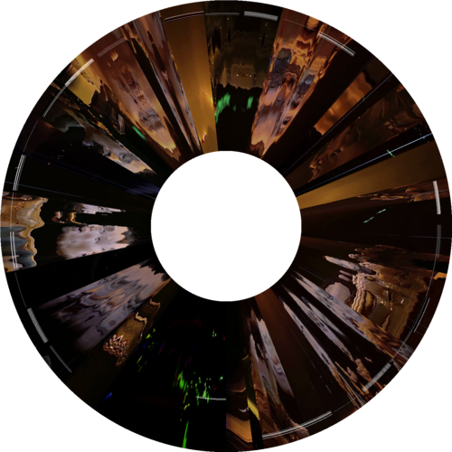
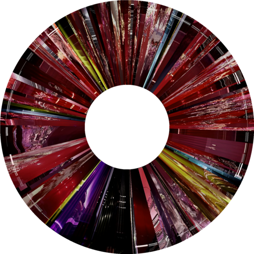
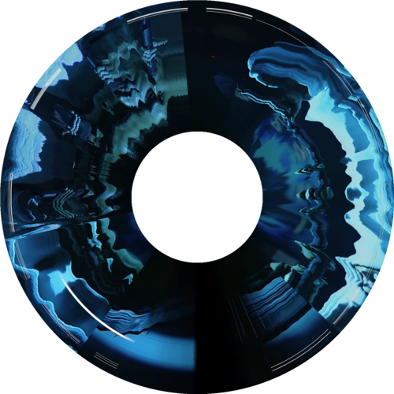
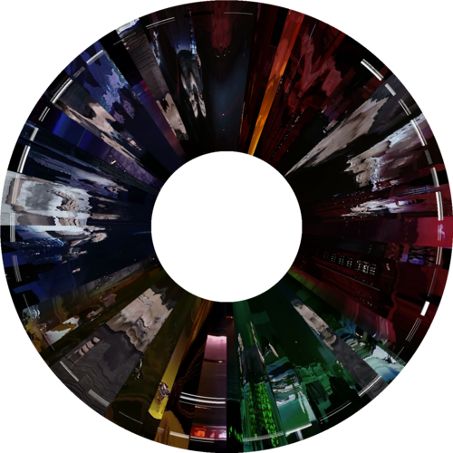
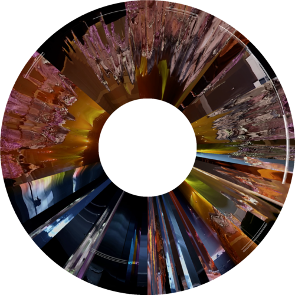
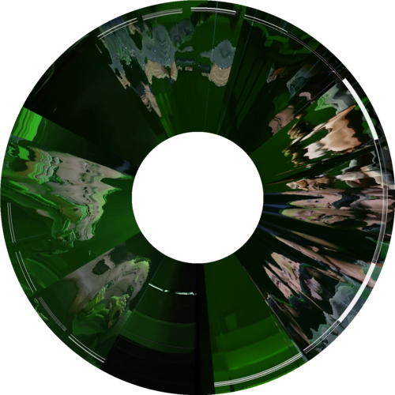

# Filmspec

Outil CLI pour générer des images de spectre de film à partir de fichiers vidéo.

#### Fonctionnement

Filmspec échantillonne uniformément les images d'un fichier vidéo dans le temps, traite chaque image selon le mode sélectionné et génère un spectre visuel unique.

**Mode Slice** - Extrait des lignes de pixels de chaque image :


**Mode Hue** - Analyse la couleur dominante de chaque image :


#### Galerie d'Exemples

Collection d'exemples de spectre radial de vidéos musicales :

<table>
<tr>
<td align="center"><br/>Monica</td>
<td align="center"><br/>不要爱他</td>
<td align="center"><br/>为你钟情</td>
</tr>
<tr>
<td align="center"><br/>共同渡过</td>
<td align="center"><br/>大热</td>
<td align="center"><br/>我</td>
</tr>
<tr>
<td align="center"><br/>春夏秋冬</td>
<td align="center"><br/>热情的沙漠</td>
<td align="center"><br/>至少还有你</td>
</tr>
</table>

#### Modes de Traitement

| Mode | Description |
|------|-------------|
| slice | Extrait une ligne de pixels (ligne ou colonne) de chaque image et les empile |
| hue | Analyse la couleur dominante de chaque image et crée un spectre de bandes de couleur |

#### Modes d'Échantillonnage et de Disposition

| Mode d'Échantillonnage | Description |
|------------------------|-------------|
| row | Extraire la ligne horizontale centrale de chaque image (mode slice uniquement) |
| col | Extraire la ligne verticale centrale de chaque image (mode slice uniquement) |

| Mode de Disposition | Description |
|---------------------|-------------|
| h | Empiler horizontalement (gauche à droite) |
| v | Empiler verticalement (haut en bas) |
| r | Disposition radiale (en forme de disque, comme un CD) |

#### Prérequis

- Rust 1.70+
- FFmpeg (doit être disponible dans le PATH système)

#### Installation

```bash
cargo install --path .
```

#### Utilisation

```bash
filmspec <INPUT> [OPTIONS]
```

#### Options

| Option | Court | Description | Défaut |
|--------|-------|-------------|--------|
| `<INPUT>` | - | Chemin du fichier vidéo | requis |
| `--output` | `-o` | Chemin de l'image de sortie | `<nom>_spectrum_slice.png` ou `<nom>_spectrum_hue.png` |
| `--width` | `-w` | Nombre d'images (h/v: largeur d'image, r: images de circonférence) | 1920 |
| `--height` | `-H` | Longueur de bande (h/v: hauteur d'image, r: largeur d'anneau) | 300 (h/v), 500 (r) |
| `--mode` | `-m` | Mode de traitement: slice/hue | slice |
| `--layout` | `-l` | Direction de disposition: h/v/r | h |
| `--sample` | `-s` | Direction d'échantillonnage: row/col (mode slice uniquement) | row |
| `--inner-radius` | - | Rayon intérieur pour la disposition radiale (pixels) | 250 |

#### Exemples

```bash
# Mode slice par défaut (1920×300, disposition horizontale, échantillonnage par ligne)
filmspec movie.mp4

# Mode spectre de teinte (analyse de couleur dominante)
filmspec movie.mp4 -m hue

# Chemin et taille personnalisés
filmspec movie.mp4 -o output.png -w 1280 -H 400

# Disposition verticale (empiler de haut en bas)
filmspec movie.mp4 -l v

# Échantillonnage par colonne en mode slice (extraire les lignes de pixels verticales)
filmspec movie.mp4 -s col

# Mode hue + disposition verticale
filmspec movie.mp4 -m hue -l v -w 400 -H 1920

# Disposition radiale (spectre en forme de disque)
filmspec movie.mp4 -l r

# Disposition radiale + paramètres personnalisés
filmspec movie.mp4 -l r -w 2400 -H 600 --inner-radius 200

# Mode hue + disposition radiale
filmspec movie.mp4 -m hue -l r
```

#### Licence

MIT
