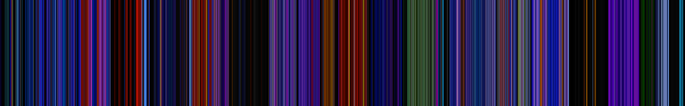

# Filmspec

動画ファイルからフィルムスペクトラム画像を生成するCLIツール。

#### 仕組み

Filmspecは動画から均等にフレームをサンプリングし、選択したモードに従って各フレームを処理し、ユニークなビジュアルスペクトラムを生成します。

**Sliceモード** - 各フレームからピクセルラインを抽出：


**Hueモード** - 各フレームの主要な色調を分析：



#### 処理モード

| モード | 説明 |
|--------|------|
| slice | 各フレームから1本のピクセルライン（行または列）を抽出して重ね合わせる |
| hue | 各フレームの主要な色調を分析してカラーバンドスペクトラムを生成 |

#### サンプリングとレイアウトモード

| サンプルモード | 説明 |
|---------------|------|
| row | 各フレームの中央水平ラインを抽出（sliceモードのみ） |
| col | 各フレームの中央垂直ラインを抽出（sliceモードのみ） |

| レイアウトモード | 説明 |
|-----------------|------|
| h | 水平方向に積み重ね（左から右へ） |
| v | 垂直方向に積み重ね（上から下へ） |

#### 前提条件

- Rust 1.70+
- FFmpeg（システムPATHで利用可能であること）

#### インストール

```bash
cargo install --path .
```

#### 使用方法

```bash
filmspec <INPUT> [OPTIONS]
```

#### オプション

| オプション | 短縮形 | 説明 | デフォルト |
|-----------|--------|------|-----------|
| `<INPUT>` | - | 入力動画ファイルパス | 必須 |
| `--output` | `-o` | 出力画像パス | `<ファイル名>_spectrum.png` または `<ファイル名>_hue.png` |
| `--width` | `-w` | 出力画像の幅 | 1920 |
| `--height` | `-H` | 出力画像の高さ | 300 |
| `--mode` | `-m` | 処理モード: slice/hue | slice |
| `--layout` | `-l` | レイアウト方向: h/v | h |
| `--sample` | `-s` | サンプル方向: row/col（sliceモードのみ） | row |

#### 例

```bash
# デフォルトsliceモード（1920×300、水平レイアウト、行サンプル）
filmspec movie.mp4

# 色調スペクトラムモード（主要な色調分析）
filmspec movie.mp4 -m hue

# 出力パスとサイズを指定
filmspec movie.mp4 -o output.png -w 1280 -H 400

# 垂直レイアウト（上から下へ積み重ね）
filmspec movie.mp4 -l v

# sliceモードで列サンプル（垂直ピクセルラインを抽出）
filmspec movie.mp4 -s col

# 色調モード + 垂直レイアウト
filmspec movie.mp4 -m hue -l v -w 400 -H 1920
```

#### ライセンス

MIT
